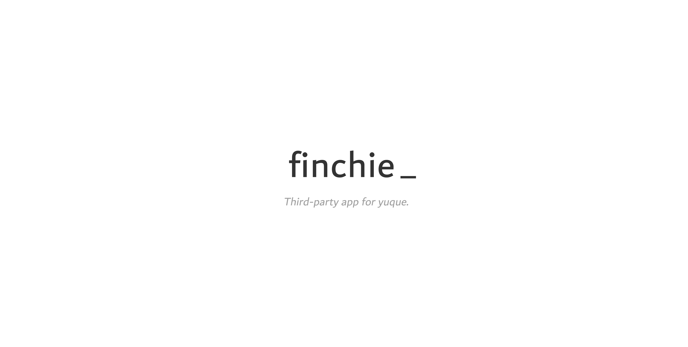

基于 `Flutter` 打造的语雀三方应用。

产品特性请阅：[产品特性书](https://www.yuque.com/mindjet/ah27gn/ygqo7f)。

A third-party app for yuque, based on `Flutter`.

Product features can be found here: [product features document](https://www.yuque.com/mindjet/ah27gn/ygqo7f).

A few resources to get you started if this is your first Flutter project:

- [Lab: Write your first Flutter app](https://flutter.io/docs/get-started/codelab)
- [Cookbook: Useful Flutter samples](https://flutter.io/docs/cookbook)

For help getting started with Flutter, view our 
[online documentation](https://flutter.io/docs), which offers tutorials, 
samples, guidance on mobile development, and a full API reference.